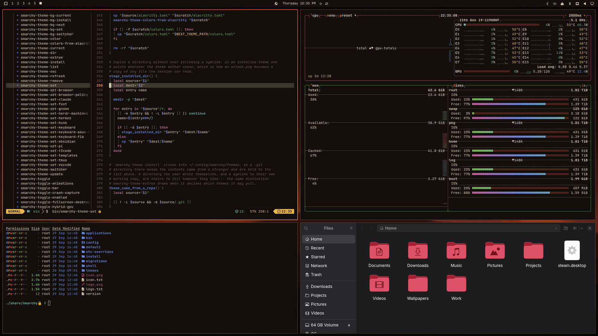

# Phobos

An Omarchy theme in rust, bone and hellfire, made for [Live Doom](https://github.com/slogonomo/live-doom).
Every colour starts from the classic 256-colour Doom palette and is tuned for terminal contrast
(body text at least 4.5:1 against the background). Active windows get a hellfire gradient border.



```bash
omarchy theme install https://github.com/slogonomo/omarchy-phobos-theme
```

or **Install > Style > Theme** in the Omarchy menu with that URL.

## Live Background

The first background, `1-live-doom`, is the **Live Doom** live background: with the
[Live Doom plugin](https://github.com/slogonomo/live-doom) installed, a bot plays Doom on your empty
desktops while it's selected, and you can click in to take over. Choose any other background to
turn it off. Without the plugin it is just a still.

## Backgrounds (Super+Ctrl+Space)

| File | What it is | Source |
|---|---|---|
| `1-live-doom.webp` | **Live Doom.** Marked LIVE DOOM; turns the live background on (needs the plugin) | original, procedural |
| `2-phobos-moon.webp` | The moon Phobos, rim-lit in hellfire | Qwen-Image 2.1 |
| `3-uac-teleporter.webp` | Teleporter room, rust-to-bone duotone | Freedoom 1 E2M2 |
| `4-ember-haze.webp` | Embers drifting up out of the dark | Qwen-Image 2.1 |
| `5-dead-city.webp` | Night city and torches, duotone | Freedoom 2 MAP17 |
| `6-cooling-rock.webp` | A single glowing crack in cooling basalt | Qwen-Image 2.1 |
| `7-candlelit-hall.webp` | Candelabra hall, graded | Freedoom 1 E3M3 |
| `8-hell-sky.webp` | Red sky over layered ridges | original, procedural |
| `9-hex-floor.webp` | A few lit hex floor tiles, out of focus | original, procedural |
| `9-nukage-flow.webp` | A slow green and teal ribbon: a cooler break | Qwen-Image 2.1 |

Omarchy sorts backgrounds with a locale-aware sort that ignores punctuation, so a `10-` prefix
would sort ahead of `1-live-doom`. The last two share `9-` to keep the live choice first.

## Other files

- `colors.toml`: the palette, including the hellfire window-border gradient.
- `icons.theme`: Yaru-red.
- `unlock.png`: the Omarchy wordmark in a hellfire gradient. Choosing Phobos in the unlock-screen picker (**Style > Unlock**) uses it, with Phobos's colours, on the boot/disk-unlock and login screens.
- `preview.png`, `preview-unlock.png`: what the theme and unlock-screen pickers show.

## Licences

- Everything original here is **CC0-1.0** ([LICENSE](LICENSE)): the palette and theme files, the procedural backgrounds (including `1-live-doom`, lettered in JetBrains Mono, OFL), the four Qwen-Image 2.1 images (generated for this theme; Qwen states outputs are not part of the model's licensed Materials and belong to the person who generates them), and the previews.
- The three Freedoom-derived backgrounds (`3-uac-teleporter`, `5-dead-city`, `7-candlelit-hall`) were rendered from **Freedoom** and stylised. Freedoom data are Copyright © 2001–2024 Contributors to the Freedoom project, under the BSD-3-Clause licence in [LICENSE-FREEDOOM.txt](LICENSE-FREEDOOM.txt).
- `unlock.png` is based on the Omarchy wordmark (Omarchy, MIT).
- **No id Software assets are included.**
